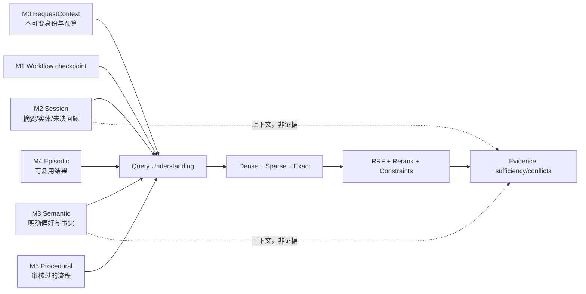

# Agent Memory 与检索体系 v2

本次升级把“对话上下文”“长期用户 Memory”和“医学证据”拆成物理及语义上独立的通道。任何 Memory 均标记 `can_support_medical_claim=false`；答案中的医学事实只能由授权检索工具返回并经 Evidence Verifier 接受的证据支持。

## Memory 安全边界

- Namespace 至少包含 `tenant_id/user_id/memory_type`；读取前在 SQL 中完成租户、所有者、类型、状态、TTL 和敏感度过滤。
- Assistant 生成、模型推断、外部检索内容和 prompt injection 不得写入长期用户事实。
- 长期写入要求用户明确指令或确认；医学敏感信息还要求系统开关和用户开关同时开启，存储值使用 Fernet 加密。
- 冲突事实不会静默覆盖：相同 subject/predicate 会生成新版本；无法判定时进入 `disputed`。
- 用户可通过 `/api/memory` 查看、添加、修改、删除、清空、停用，并查看审计记录。
- M1 checkpoint 可选 MySQL 或 PostgreSQL；PostgreSQL 后端支持按 `tenant/user/thread` 从进程重启中恢复。

## 检索与证据

- 授权范围在同一 SQL 中限定 `tenant_id + kb_id`，空 KB scope 直接 fail closed。
- Dense、Sparse 和医学实体/编码 Exact 三路并行，单路失败返回 `partial`，全部超时返回 `timeout`，系统错误不会伪装成 `no_result`。
- RRF 保留各路分数；随后执行去重、可选 rerank、数值/人群/时间/否定约束、来源权威度、父块及条件邻块扩展和 token 预算。
- Evidence Verifier 拒绝 Memory、未授权、人工复核未通过和 prompt-injection 证据；显式识别推荐方向与剂量冲突。
- `/api/retrieval/debug/{request_id}` 提供脱敏追踪；原始查询只存哈希，正文仅存短预览和哈希。

主要配置见 `medagent-backend/.env.example`：`ENABLE_NEW_MEMORY_ARCHITECTURE`、`MEMORY_ENABLED`、`LONG_TERM_MEMORY_ENABLED`、`ENABLE_EVIDENCE_VERIFICATION`、`RETRIEVAL_*` 和 `CHECKPOINTER_BACKEND`。混合检索是唯一模式，不再提供启停开关。
