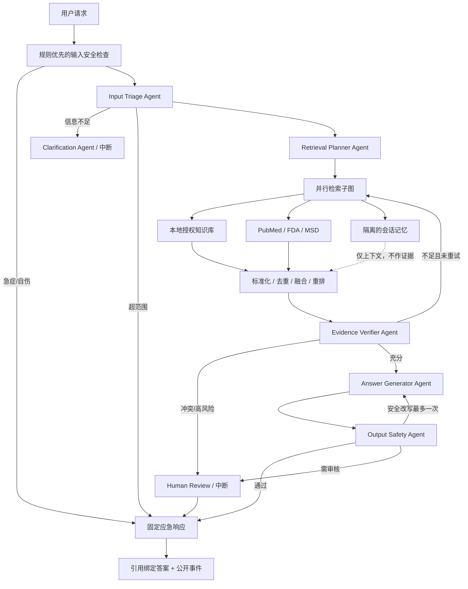

# 受控多 Agent 架构

系统采用一个且仅一个 Supervisor。专业 Agent 只返回严格 Pydantic 结构，不能选择下一个 Agent；工具只能通过显式白名单调用。

Supervisor 是唯一的路由决策点。急症路径在规则层直接短路，Agent 和 Tool 调用数均为 0。证据不足只允许一次检索重试；答案只能看到 `verified_evidence`，引用 ID 由后端绑定。

## 隔离边界

- 本地检索输入必须包含 `user_id`、`tenant_id` 和非空授权 KB 范围；工具在数据库层再次验证。
- 在线证据使用服务端 HMAC ID，并保留来源、URL、检索时间和权威等级。
- 会话记忆按用户、租户、线程和 TTL 隔离，永远设置为非医学证据。
- Prompt、Agent 版本、模型/规则执行方式、延迟、Token、成本和错误码写入 Trace。
